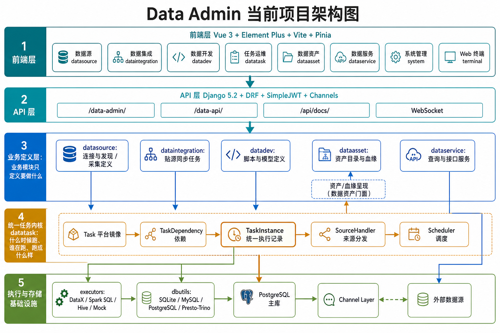

# Data Admin

Data Admin 是一个面向数据平台建设的统一管理后台，覆盖数据源接入、元数据发现、贴源同步、数据开发、任务编排、资产目录、血缘呈现和数据服务等核心场景。项目采用前后端分离架构，前端基于 Vue 3 与 Element Plus，后端基于 Django 5.2 与 DRF，并通过 `datatask` 统一承载任务定义、依赖关系、执行实例与调度分发。

当前主干以 **ADR-001 + ADR-002 + ADR-003** 为架构基线，模块职责围绕“连接与发现、数据集成、数据开发、任务运维、资产与服务”五个阶段收敛。



## 核心能力

| 阶段 | 模块 | 主要能力 |
|------|------|----------|
| Connection & Discovery | `datasource` | 数据源配置、连通性测试、数据库/表/字段发现、源数据采集到资产 |
| Data Integration | `dataintegration` | 贴源同步任务配置、同步任务执行、集成执行记录接入统一任务内核 |
| Data Development | `datadev` | 脚本开发、模型设计、研发态执行与记录管理 |
| Orchestration & DataOps | `datatask` | 统一任务镜像、任务依赖、执行实例、调度、来源分发 |
| Assetization & Service | `dataasset` / `dataservice` | 资产目录、数据血缘、数据查询、API 服务 |
| Platform Management | `system` / `terminal` | 用户、角色、菜单、登录鉴权、Web 终端 |

## 架构说明

项目按前端层、API 层、业务定义层、统一任务内核和执行存储基础设施分层：

- **前端层**：提供数据源、数据集成、数据开发、任务运维、资产、数据服务、系统管理和 Web 终端等工作台页面。
- **API 层**：通过 `/data-admin/`、`/data-api/`、`/api/docs/` 与 WebSocket 暴露管理端、业务接口、接口文档和实时通道能力。
- **业务定义层**：各业务模块只定义“要做什么”，例如采集定义、同步任务、开发脚本、资产目录和服务接口。
- **统一任务内核**：`datatask` 负责“什么时候跑、谁在跑、跑成什么样”，将不同来源的任务统一为任务实例与调度记录。
- **执行与存储基础设施**：通过执行器、数据库工具、主库、Channel Layer 和外部数据源完成实际执行、状态存储与通信。

## 当前重要口径

1. `datasource` 已不再维护 snapshot 模型；当前通过 `DataSourceCollectionTask + task_handler` 保留单表采集与整库异步采集能力，采集执行记录统一进入 `datatask.TaskInstance`。
2. `dataintegration` 已改为直接填写 `sourceDatabaseName` / `sourceTableName`，不再依赖 snapshot 选择。
3. 删除数据源不会再被历史集成任务阻塞；若任务失去数据源绑定，需重新绑定后再执行。
4. 登录链路当前包含验证码校验与失败次数限流。

## 技术栈

- **后端**：Django 5.2、Django REST Framework、SimpleJWT、Channels、drf-spectacular
- **前端**：Vue 3、Element Plus、Vite、Pinia、Vue Router、Axios、ECharts、xterm.js、Ace Editor
- **数据连接**：SQLite、MySQL、PostgreSQL、Presto/Trino、Hive、Mock
- **包管理器**：`uv`（后端）、`pnpm`（前端）
- **默认数据库**：PostgreSQL（读取 `backend/config/env.py`），可通过 `DJANGO_DATABASE_*` 环境变量覆盖为 SQLite 或其他后端

## 快速开始

### 后端

```bash
cd backend
uv sync
uv run python manage.py migrate
uv run python manage.py initdata
uv run python manage.py runserver 0.0.0.0:8000
```

### 前端

```bash
cd frontend
pnpm install
pnpm dev
```

### 访问地址

- 前端：`http://localhost:80/data-admin/`
- API：`http://localhost:8000/data-api/`
- API 文档：`http://localhost:8000/api/docs/`
- 默认账号：`admin / admin123`

## 目录结构

```text
data-admin/
├── backend/                    # Django 后端
│   ├── apps/
│   │   ├── datasource/         # 连接与发现
│   │   ├── dataintegration/    # 数据集成
│   │   ├── datadev/            # 数据开发
│   │   ├── datatask/           # 任务运维内核
│   │   ├── dataasset/          # 资产与血缘
│   │   ├── dataservice/        # 查询与接口服务
│   │   ├── system/             # 用户/角色/菜单/登录
│   │   └── terminal/           # Web 终端
│   └── config/                 # Django 配置
├── frontend/                   # Vue 前端
│   └── src/
│       ├── api/                # 接口封装
│       ├── views/              # 页面
│       ├── store/              # Pinia 状态
│       └── router/             # 路由
└── docs/                       # 需求、ADR、架构与变更记录
```

## 文档入口

- 统一入口：`docs/README.md`
- 当前状态：`docs/requirements/active_tasks.md`
- 架构决策：`docs/adr/`
- 架构图示：`docs/architecture/`
- 历史归档：`docs/archive/`

## 开发约束

1. 新模块或重构模块前，先阅读 `docs/adr/ADR-002-平台分层与五阶段职责.md`。
2. 涉及统一任务定义、执行实例、调度或来源分发时，同步参考 `docs/adr/ADR-003-统一任务内核与执行实例边界.md`。
3. 提交前同步更新 `docs/requirements/active_tasks.md` 与 `docs/changelog.md`。
4. 默认遵循：**主干稳定、短分支交付、单分支单目标**。
