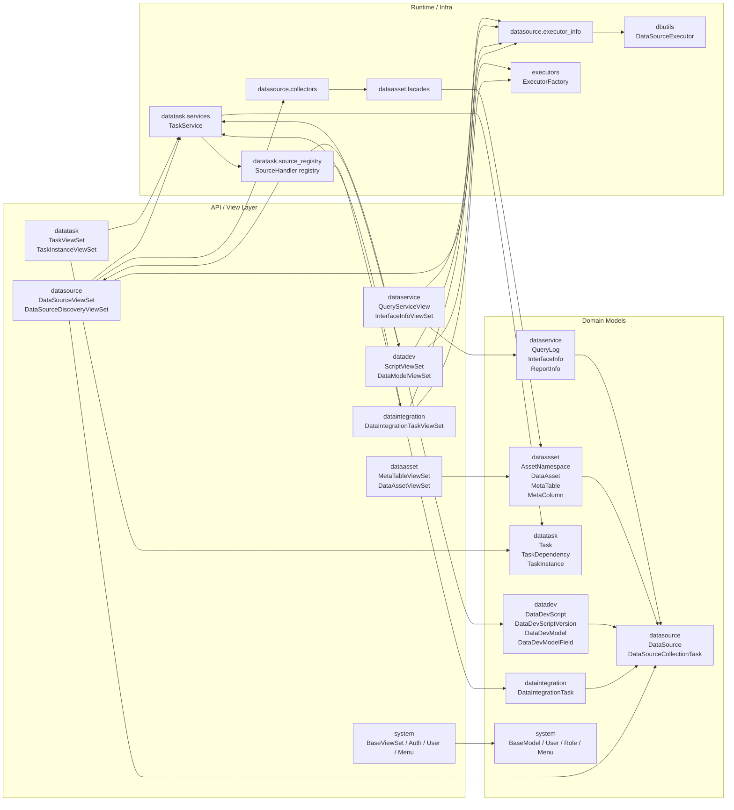

# 后端现状架构评审稿（2026-04-28）

## 1. 评审范围

本次评审只覆盖当前后端主干中与平台主链路直接相关的模块：

- `apps.datasource`
- `apps.dataintegration`
- `apps.datadev`
- `apps.datatask`
- `apps.dataasset`
- `apps.dataservice`
- `apps.system`
- `apps.dbutils`
- `apps.executors`

评审依据：

1. `ADR-010-后端平台分层与模块职责重构`
2. `ADR-011-平台五阶段职责划分规范`
3. `ADR-012-统一任务定义与执行实例边界规范`
4. 当前主干中的模型、视图、任务来源注册和执行链代码

## 2. 结论摘要

当前后端主干已经基本形成“业务入口层 + 平台任务内核 + 资产语义层 + 执行基础设施”的稳定结构，整体与 ADR-010 / ADR-011 / ADR-012 一致。

当前判断如下：

1. `datasource`、`dataintegration`、`datadev` 已各自保留正式任务定义模型，没有再把 `datatask.Task` 当作业务真身。
2. `datatask.TaskInstance` 已成为统一执行记录中心，`datasource`、`dataintegration`、`datadev` 均通过平台实例记录运行历史。
3. `datatask` 当前通过 `source handler / registry` 分发来源能力，执行记录的实例归一化与失联恢复也已由来源模块自行注册，平台内核不再直接反向依赖 `datasource.collectors`。
4. `dataasset` 作为资产沉淀层的角色已经相对清晰，`datasource -> dataasset` 的跨域写入通过 facade 进入，边界比早期实现收敛很多。

综合结论：

- **无新的阻断级架构问题**。
- **当前最主要的剩余风险是局部职责过载和历史命名遗留，而不是主干边界再次失控**。

## 3. 代码级实际架构图

## 4. 各模块主要类与职责判断

### 4.1 `apps.system`

核心类：

- `BaseModel`
- `BaseModelSerializer`
- `BaseViewSet`
- `HasRolePermission`

判断：

- `system` 已实际承担平台基础骨架层角色。
- 该层对全项目提供统一 CRUD、软删除、审计字段和权限约定，是事实上的基础框架层。

### 4.2 `apps.datasource`

核心类：

- `DataSource`
- `DataSourceCollectionTask`
- `DataSourceViewSet`
- `DataSourceDiscoveryViewSet`

实际职责：

- 数据源定义与连通性校验
- 数据库 / 表 / 字段发现
- 单表采集、整库采集编排
- 统一连接上下文构建
- 通过 `task_source.py` 将 `datasource.collection` 注册为平台任务来源

判断：

- 已符合 Connection & Discovery 阶段定位。
- 本轮修复后，数据源采集实例的“失联恢复 / 展示前归一化”也由 `datasource` 自己注册给 `datatask`，边界较之前更合理。

### 4.3 `apps.dataintegration`

核心类：

- `DataIntegrationTask`
- `DataIntegrationTaskViewSet`

实际职责：

- 维护贴源同步任务定义
- 通过 `task_source.py` 同步平台任务镜像
- 通过执行器工厂完成统一执行
- 执行记录统一查询 `TaskInstance`

判断：

- 已符合 Data Integration 阶段定位。
- 没有继续保留独立正式执行中心，符合 ADR-012。

### 4.4 `apps.datadev`

核心类：

- `DataDevScript`
- `DataDevScriptVersion`
- `DataDevModel`
- `DataDevModelField`
- `ScriptViewSet`
- `DataModelViewSet`

实际职责：

- 维护脚本定义、版本快照和模型定义
- 将脚本任务与模型任务同步到 `datatask`
- 负责脚本执行、模型建表执行和发布快照构建

判断：

- 主职责正确，符合 Data Development 阶段定位。
- 但 `task_source.py` 已同时承载“任务同步、执行编排、引擎选择、DDL 生成、模型执行”，职责密度偏高，是当前后端最明显的局部热点。

### 4.5 `apps.datatask`

核心类：

- `Task`
- `TaskDependency`
- `TaskInstance`
- `TaskService`
- `SourceHandler`
- `TaskViewSet`
- `TaskInstanceViewSet`

实际职责：

- 平台级任务镜像
- 依赖拓扑与运行实例
- 调度与执行分发
- 任务运维查询视图
- 通过 registry 调用来源模块暴露的能力

判断：

- 已基本符合 Orchestration & DataOps 阶段定位。
- 本轮收口后，`datatask` 不再直接 import `datasource.collectors`，平台内核对来源业务实现的侵入进一步降低。

### 4.6 `apps.dataasset`

核心类：

- `AssetNamespace`
- `DataAsset`
- `DataAssetColumn`
- `MetaTable`
- `MetaColumn`
- `TableLineage`

实际职责：

- 维护兼容元数据模型与规范资产模型
- 同步资产命名空间、表、字段和血缘基础对象
- 通过 facade 对外暴露采集写入能力

判断：

- 已符合 Assetization & Service 阶段的语义沉淀角色。
- 当前仍带有元数据兼容层和规范资产层双轨并存的复杂度，但边界方向是对的。

### 4.7 `apps.dataservice`

核心类：

- `QueryServiceView`
- `InterfaceInfoViewSet`
- `InterfaceFieldViewSet`
- `ReportInfoViewSet`

实际职责：

- 提供查询执行、接口发布、报表配置与查询日志
- 复用 `datasource.executor_info` 和 `dbutils` 执行链

判断：

- 属于“资产化与服务”后的服务化输出支线。
- 该模块当前不接入统一任务中心是合理的，因为它面向的是交互查询与接口服务，不是长期调度作业。

## 5. 正向结论

1. **任务边界已经基本落地**：业务定义在业务模块，平台镜像与实例在 `datatask`。
2. **执行记录口径已经统一**：当前主干不存在第二套正式执行中心。
3. **连接上下文已收敛**：`apps.datasource.executor_info` 已成为统一连接上下文入口。
4. **资产写入边界已收敛**：`datasource` 通过 `dataasset.facades` 入资产，不再直接依赖内部服务实现。
5. **本轮已消除一处关键反向依赖**：`datatask` 不再知道 `datasource.collectors` 的内部恢复逻辑。

## 6. 剩余问题与风险

### 6.1 中优先级：`datadev.task_source.py` 职责过载

表现：

- 同一文件同时承担任务同步、平台快照、执行编排、引擎选择、建模 DDL 生成、模型执行。

风险：

- 任一开发需求都容易改动同一热点文件。
- 发布快照逻辑和运行逻辑耦合过深，后续维护成本会持续升高。

建议：

- 后续可在 `datadev` 内部拆为 `task_sync`、`script_execution`、`model_execution` 三类内部模块，但不建议在本轮继续扩 scope。

### 6.2 中优先级：`DataSource` 物理表名仍保留历史归属痕迹（已收敛）

表现：

- `DataSource` 的 `db_table` 曾保留为 `dataasset_datasource`。
- 当前已通过后续迁移收敛为 `datasource_data_source`。

风险：

- 代码归属与物理表归属长期不一致。
- 迁移、排障和 SQL 审计时会持续增加理解成本。

建议：

- 作为后续独立治理项评估是否做表名迁移；本轮不建议联动数据库迁移。

### 6.3 低优先级：`system.BaseViewSet` 承担全局过多隐式约定

表现：

- 统一 CRUD、软删除、批量删除、详情包装、基于唯一键复用旧记录等都被塞在同一个基类。

风险：

- 业务模块容易被基类默认行为“顺带影响”，出现不显式但很强的框架约束。

建议：

- 后续可逐步把“通用 CRUD”与“项目特化兼容逻辑”分离；当前不构成阻断问题。

## 7. 评审结论

当前后端主干**可以继续在现有架构基线下演进**，无需再进行一轮“大拆大重构”。

本轮代码修复后，最关键的边界要求已经进一步落地：

- `datatask` 只通过 source handler 协议使用来源能力。
- `datasource` 自己声明并注册执行记录归一化 / 失联恢复规则。
- 平台内核不再直接耦合来源模块内部 collector 实现。

后续应优先做的是局部热点收敛，而不是再次改写整体分层。