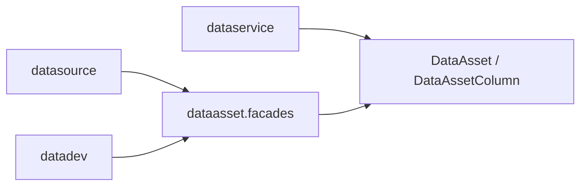

# dataasset 模块架构

## 模块定位

`apps.dataasset` 是平台资产语义层，负责把源端发现、开发模型和服务消费沉淀为可管理的数据资产。

它不是连接执行模块，也不是任务调度模块；它负责资产命名、资产分类、字段语义、生命周期、安全等级和资产浏览。

## 核心职责

1. 维护 `AssetNamespace`，表达数据源、环境、catalog 和 schema 的资产命名空间。
2. 维护 `DataAsset`，表达表、视图、物化视图等规范资产。
3. 维护 `DataAssetColumn`，表达资产字段、类型、业务术语、字段角色和安全等级。
4. 保留 legacy 元数据模型兼容能力，并逐步向 `asset*` 主模型收敛。
5. 提供 `facades/` 作为跨模块写资产的公开边界。

## 关键模型

- `AssetNamespace`：资产命名空间。
- `DataAsset`：规范资产主表。
- `DataAssetColumn`：规范资产字段。
- `MetaTable` / `MetaColumn`：历史元数据兼容模型。

## 协作关系

## 边界约束

1. 跨模块写入资产默认通过 `dataasset.facades`。
2. 资产模块不直接持有外部数据库连接能力。
3. 新功能优先消费 `asset / asset-column`，`meta-*` 只做兼容保留。
4. 资产归属、命名和字段写入必须保持幂等，避免重复采集产生多份资产。
5. 服务接口绑定资产时，需要校验接口数据源与资产所属数据源一致。

## 演进方向

1. 继续从 legacy 元数据浏览向规范资产浏览迁移。
2. 补齐血缘、质量、安全分级、生命周期等治理能力，但保持资产语义层边界。
3. 让 `dataservice` 和后续消费入口都以 `DataAsset` 作为可追溯锚点。
