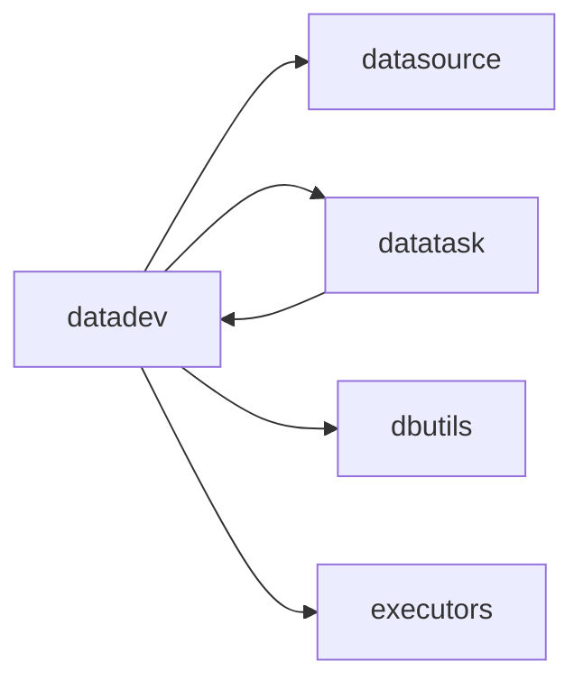

# datadev 模块架构

## 模块定位

`apps.datadev` 负责数仓开发阶段的作业、版本和模型定义。它承载 SQL/Python 加工作业、脚本版本、模型字段和建表动作。

当前架构中，只有 `DataDevScript` 是可发布到任务中心的业务任务定义；`DataDevModel` 是模型定义，不作为平台任务真源。

## 核心职责

1. 维护 `DataDevDirectory`，组织开发目录和数仓分层入口。
2. 维护 `DataDevScript`，作为加工作业定义。
3. 维护 `DataDevScriptVersion`，保存脚本内容、当前版本和正式发布版本。
4. 维护 `DataDevModel` 与 `DataDevModelField`，描述模型、目标表和字段结构。
5. 提供脚本保存、版本发布、手动执行和发布到任务中心能力。
6. 通过 `dbutils` 或 `executors` 执行 SQL 查询、MVP 预演、Spark/Hive 类任务。

## 关键模型

- `DataDevDirectory`：数据开发目录。
- `DataDevScript`：加工作业定义。
- `DataDevScriptVersion`：作业版本快照。
- `DataDevModel`：数据模型定义。
- `DataDevModelField`：模型字段定义。

## 协作关系

脚本可绑定数据源和目标模型；发布后由 `datatask` 形成任务镜像；运行时按引擎类型选择 `dbutils` 或 `executors`。

## 边界约束

1. `DataDevModel` 不同步为 `datadev.model` 平台任务镜像。
2. 不恢复 `DataDevScriptExecution` 私有执行表，执行记录统一进入 `TaskInstance`。
3. 脚本列表的任务状态应通过统一注解或服务查询，避免序列化器逐条查询造成 N+1。
4. 权限按 action 绑定到菜单 `perms`，写操作不得复用只读权限码。
5. 目录管理只维护目录树，不展示不存在的目录与脚本绑定关系。

## 演进方向

1. 将模型建表动作进一步复用脚本执行链路和统一执行器。
2. 强化版本发布语义，明确当前版本、正式版本和任务发布快照之间的关系。
3. 让质量校验、回刷和 Python 作业逐步使用标准 source handler 契约。
