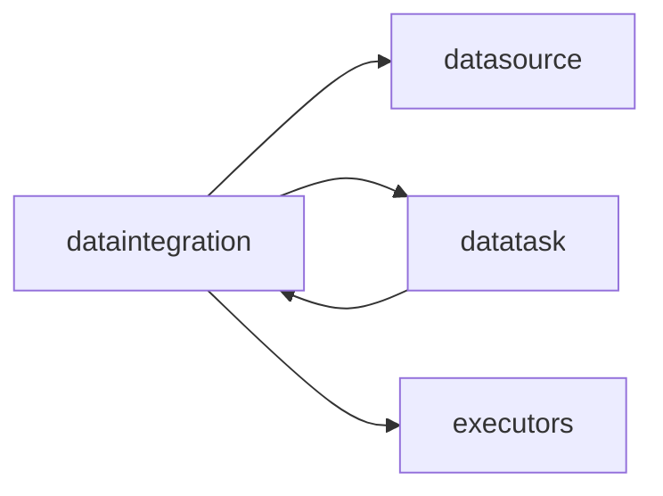

# dataintegration 模块架构

## 模块定位

`apps.dataintegration` 负责数据搬运任务的业务配置，覆盖源表、目标表、字段映射、加载方式、写入方式和执行器选择。

它保存“要同步什么、怎么同步”的业务定义；调度、依赖和执行实例由 `datatask` 统一管理。

## 核心职责

1. 维护 `DataIntegrationTask` 作为数据集成任务真源。
2. 支持源数据源、目标数据源、源库表、目标库表、字段映射和增量字段等配置。
3. 区分保存业务配置与发布到任务中心，未发布任务可以手动执行，但不自动进入调度。
4. 发布时将当前配置快照同步为 `datatask.Task.task_config`。
5. 执行时通过 source handler 调用 `executors`，并把结果归一为 `{ok,msg,data}`。

## 关键模型

- `DataIntegrationTask`：数据集成任务定义，包含源端、目标端、加载策略、写入策略、字段映射、调度候选字段和执行器类型。

## 协作关系

数据集成任务引用 `DataSource` 作为源端和目标端；发布后由 `datatask` 纳管调度索引；实际运行通过 `executors` 生成并执行 DataX 或 mock 配置。

## 边界约束

1. 创建和编辑任务只保存业务配置，不默认发布到任务中心。
2. 手动执行可以生成 `TaskInstance`，但不能把任务自动变成调度任务。
3. `dataintegration` 不维护私有执行日志表。
4. `datatask` 不直接理解字段映射和同步策略细节，只保存发布快照并分发来源执行。
5. 新增同步引擎时优先扩展 `executors`，不要把执行器逻辑写进 View 或 Serializer。

## 演进方向

1. 强化发布前校验，确保源端、目标端和字段映射完整。
2. 将 DataX 配置构造能力继续沉淀到 `executors.datax_config_builder`。
3. 补齐增量同步、失败重试和结果摘要的稳定结构。
