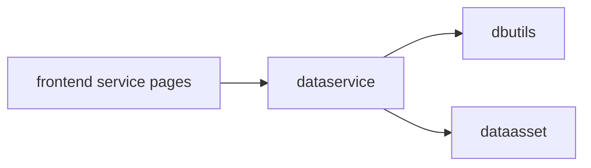

# dataservice 模块架构

## 模块定位

`apps.dataservice` 是平台服务消费出口，负责把数据查询、接口定义、报表定义和调用审计组织成面向消费方的 API 能力。

它依赖 `dbutils` 执行只读查询，可选绑定 `dataasset.DataAsset` 作为资产锚点。

## 核心职责

1. 维护数据接口定义、接口字段、报表定义和查询日志。
2. 提供在线查询、接口执行、导入导出和调用审计能力。
3. 执行 SQL 前做只读语句治理和行数限制。
4. 发布接口时校验绑定资产与接口数据源的一致性。
5. 对前端提供统一 `/dataservice/` 后端访问前缀。

## 协作关系

## 边界约束

1. 只允许单条 SELECT / WITH / SHOW / DESCRIBE / EXPLAIN 类语句。
2. 普通查询和导出都必须设置最大行数限制。
3. 新增或更新接口、报表编码时，显式拦截重复编码，不依赖数据库唯一约束报错。
4. 报表与接口关联关系更新或删除前，需要清理历史软删除重复记录。
5. 导出统一使用当前存在的 export 路径，避免前端调用历史断链接口。

## 演进方向

1. 强化接口生命周期、权限授权、调用配额和审计。
2. 以资产锚点作为服务治理入口，逐步支持资产到服务的影响分析。
3. 将查询治理规则沉淀为可复用策略，避免分散在多个 View 中。
