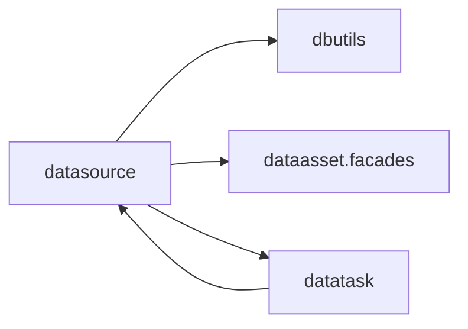

# datasource 模块架构

## 模块定位

`apps.datasource` 是平台连接与发现阶段的入口，负责保存数据源连接定义、执行连通性校验、发现库表字段，并定义源数据采集任务。

它是“连接信息和源端发现”的业务真源，不是数据集成、数据开发或任务调度中心。

## 核心职责

1. 维护 `DataSource`，包括数据库类型、主机、端口、账号、加密密码、连接状态等。
2. 通过 `dbutils` 执行连通性测试、数据库列表、表列表和字段列表探查。
3. 维护 `DataSourceCollectionTask`，作为源数据采集的正式业务定义。
4. 将采集结果通过 `dataasset.facades` 写入资产命名空间、资产主表和资产字段。
5. 通过 `task_handler.py` 向 `datatask` 注册采集任务加载、执行、实例恢复和结果归一化能力。

## 关键模型

- `DataSource`：数据源连接定义。
- `DataSourceCollectionTask`：数据源采集任务定义。

历史 snapshot 和独立采集运行表已经收敛，采集运行记录统一进入 `datatask.TaskInstance`。

## 协作关系

`datasource` 调用 `dbutils` 获取外部库表字段信息；采集到的元数据通过 `dataasset.facades` 写入资产层；任务中心通过 source handler 反向调用采集执行能力。

## 边界约束

1. 不在 `datasource` 内重复实现数据库驱动适配。
2. 不把调度字段、依赖关系、平台发布快照重新塞回 `DataSourceCollectionTask`。
3. 不绕开 `dataasset.facades` 直接写资产内部模型。
4. 不维护私有执行历史表；执行状态、错误信息和结果摘要统一进入 `TaskInstance`。
5. 删除数据源时，需要同步考虑关联采集任务和下游业务任务的失效处理。

## 演进方向

1. 将连接上下文进一步沉淀为稳定 facade，减少其他模块对内部文件的直接引用。
2. 保持采集任务与任务中心的发布边界清晰，避免重新出现任务双写真源。
3. 源端发现能力继续服务资产沉淀，但不扩张为资产治理模块。
