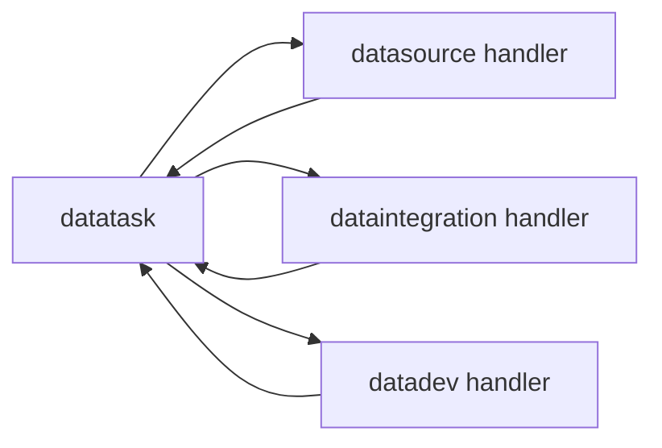

# datatask 模块架构

## 模块定位

`apps.datatask` 是平台统一任务内核，负责任务镜像、调度索引、依赖关系和执行实例。

它不保存业务任务真源；业务真源在 `datasource`、`dataintegration`、`datadev` 等来源模块中。

## 核心职责

1. 维护 `Task`，作为已发布或纳管任务的平台镜像。
2. 维护 `TaskDependency`，描述任务间依赖关系。
3. 维护 `TaskInstance`，记录所有手动、定时和依赖触发执行。
4. 通过 `source_registry` 按 `source_module` 查找来源模块 handler。
5. 通过 `TaskService` 创建实例、执行任务、更新治理字段、读写发布快照、归一化执行结果。
6. 通过 scheduler 扫描可运行任务，并触发后台执行与失联实例清理。

## 关键模型

- `Task`：平台任务镜像，包含任务类型、来源模块、来源记录、调度类型、cron、owner、发布快照和最近运行状态。
- `TaskDependency`：平台任务依赖关系。
- `TaskInstance`：统一执行实例。

## SourceHandler 契约

来源模块通过 handler 向任务中心暴露能力。执行结果统一返回：

```json
{
  "ok": true,
  "msg": "success",
  "data": {}
}
```

当来源模块异常或返回结构不符合约定时，`TaskService.execute_task` 必须稳定降级为失败 envelope，并记录错误信息。

## 协作关系



## 边界约束

1. `Task` 不是完整业务定义表，只保存平台纳管和调度所需的公共字段。
2. 发布快照读写统一走 `TaskService.get_published_snapshot` 和 `TaskService.build_task_config_payload`。
3. `TaskViewSet` 不直接拼装调度治理字段，统一委托 `TaskService.update_task_governance`。
4. 任务详情和执行记录读取链路不得执行失联恢复或其他写数据库动作。
5. 任务中心不直接 import 来源模块内部执行函数，应通过 registry 和 handler 进行分发。

## 演进方向

1. 持续强化 `SourceHandler` 类型契约和返回结构。
2. 把发布快照、运行时覆盖参数和来源 live 配置的优先级保持清晰。
3. 依赖调度、失败重试和告警可以增强，但不能破坏“业务定义真源在来源模块”的边界。
