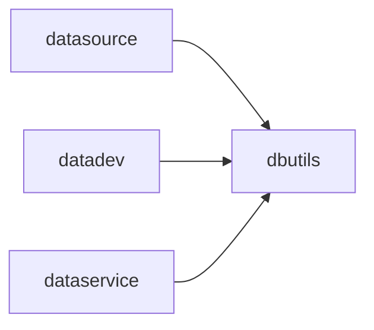

# dbutils 模块架构

## 模块定位

`apps.dbutils` 是平台数据库访问适配层，负责外部数据源连接、只读查询、库表字段探查和方言差异屏蔽。

它为 `datasource`、`datadev`、`dataservice` 等模块提供统一数据库执行能力。

## 核心职责

1. 通过统一工厂创建数据库执行器。
2. 支持 MySQL、PostgreSQL、SQLite、Presto/Trino、StarRocks 等外部数据源。
3. 执行连接测试、数据库列表、表列表、字段列表和只读查询。
4. 在执行层承接基础 SQL 安全限制和最大行数限制。
5. 对不同数据库方言差异做适配。

## 关键文件

- `base.py`：数据库执行器基础接口。
- `factory.py`：数据库执行器工厂。
- `mysql.py`：MySQL / StarRocks 适配。
- `postgres.py`：PostgreSQL 适配。
- `presto.py`：Presto / Trino 适配。
- `sqlite.py`：SQLite 适配。

## 协作关系

## 边界约束

1. 新增数据库类型优先扩展 `dbutils`，不要在业务模块中直接写驱动代码。
2. 业务模块不应绕开 `dbutils` 自行维护连接池或数据库执行器。
3. 只读 SQL 校验和行数限制应尽量在本层统一，前端校验只能作为辅助。
4. 数据库连接凭证来源应来自 `datasource` 的连接定义或统一连接上下文。

## 演进方向

1. 将连接上下文、超时、取消和错误码归一化做成通用能力。
2. 提升 SQL 安全解析能力，减少字符串规则误判。
3. 为资产采集、数据服务和开发查询提供更稳定的元数据接口。
