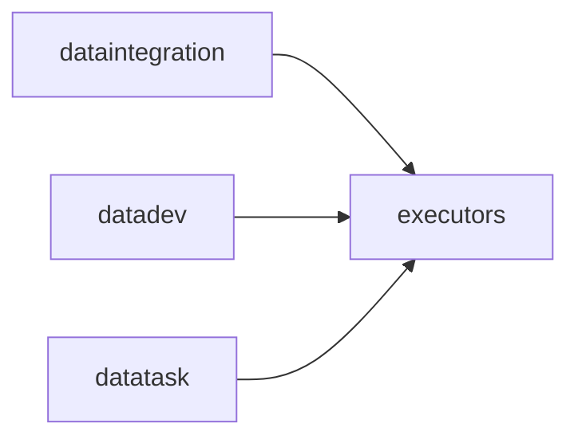

# executors 模块架构

## 模块定位

`apps.executors` 是平台任务运行器层，负责承接 DataX、Spark SQL、MVP mock 等实际运行能力。

业务模块描述“要执行什么”，`executors` 负责把这些描述转换成可运行的引擎调用和稳定结果。

## 核心职责

1. 通过 `ExecutorFactory` 创建具体执行器。
2. 构造 DataX 配置并触发 DataX 执行。
3. 执行 Spark SQL 或 MVP 预演。
4. 为 `dataintegration`、`datadev`、`datatask` 返回稳定的执行结果结构。
5. 将执行器相关扩展集中在本模块，减少业务模块重复实现。

## 关键文件

- `base.py`：执行器基础接口。
- `factory.py`：执行器工厂。
- `datax_config_builder.py`：DataX 配置构造。
- `datax_executor.py`：DataX 执行器。
- `sparksql_executor.py`：Spark SQL 执行器。
- `mock.py`：模拟执行器。

## 协作关系

## 边界约束

1. 新增任务运行方式优先扩展 `executors`，不要在 View 或 Serializer 中直接拼执行逻辑。
2. 执行器返回结构要便于 `datatask` 写入 `TaskInstance.result_summary` 和 `error_message`。
3. 引擎配置构造和实际执行分开，避免业务配置与运行器细节耦合。
4. 执行器不保存业务任务定义，也不维护执行实例表。

## 演进方向

1. 统一执行结果协议，减少来源模块二次包装。
2. 补齐超时、取消、日志流和资源限制。
3. 为后续异步队列或外部调度引擎接入保留接口。
