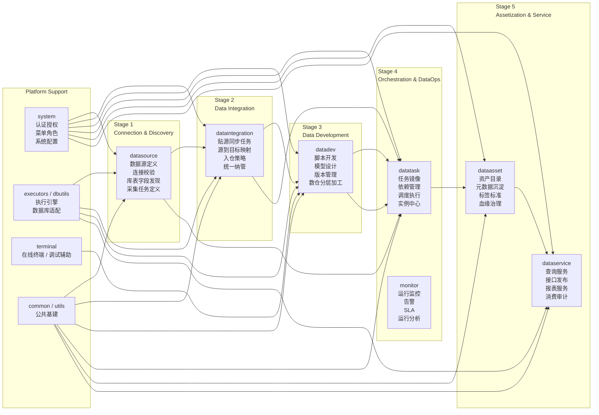
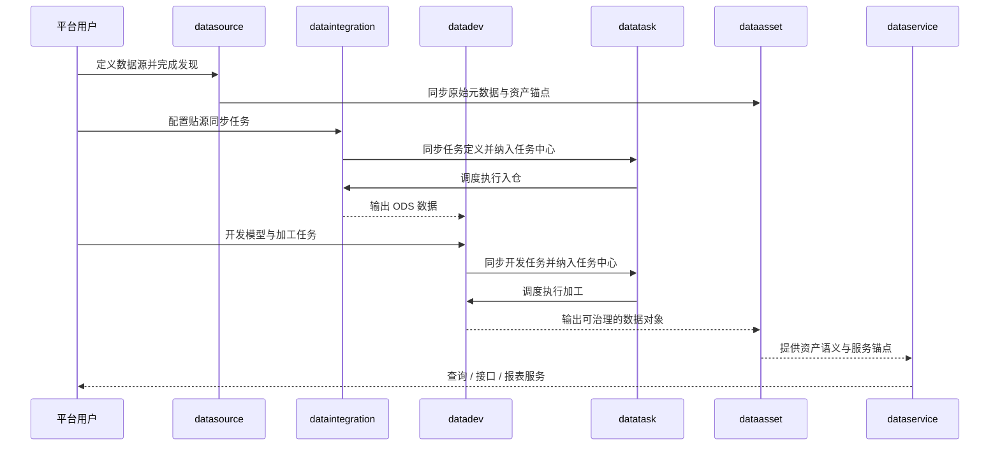

# 平台目标架构图与模块职责图（2026-04-30）

## 1. 文档定位

本文基于当前项目主干目录、ADR-010、ADR-011、ADR-012 与现状状态页，给出一版面向后续建设的**目标架构图**与**模块职责图**。

本文不是替代 ADR 的正式边界文件，而是把当前项目已经形成的模块骨架，整理成一版更适合沟通、评审和后续实施拆解的目标平台蓝图。

## 2. 设计目标

平台目标不是继续堆叠单点功能，而是在当前主干基础上收敛为一套可持续演进的统一数据平台，满足以下要求：

1. 形成从连接发现、数据集成、数仓开发、任务运营、资产治理到服务消费的完整主链路。
2. 保持业务定义与平台运行时分离，避免 `datatask` 反向侵入业务模块。
3. 把治理要求嵌入研发、发布、运行和消费链路，而不是额外建设治理孤岛。
4. 让 `dataasset` 成为统一语义锚点，让 `dataservice` 成为统一消费出口。

## 2.1 当前阶段收敛口径

结合当前项目推进节奏，现阶段先不把“任务发布、独立发布快照、发布版本冻结”作为主线交付目标，先聚焦两件事：

1. 业务任务定义必须留在各自业务模块中，不能回退为由 `datatask` 直接承载业务真身。
2. 平台任务运维必须统一纳管到 `datatask.Task` 与 `datatask.TaskInstance`，形成统一任务台账、统一实例中心和统一运维视图。

因此，本文后续所有图示都按“**先完成任务定义真源 + 任务运维纳管，再补发布/快照能力**”的阶段口径理解。

## 3. 平台目标架构图

```mermaid
flowchart TB
    subgraph UX[用户与接入层]
        WEB[frontend\nVue3 + Element Plus]
        APIUSER[数据消费者\n报表 / 接口 / 查询]
        OPSUSER[平台运营人员\n开发 / 运维 / 治理]
    end

    subgraph API[平台应用层]
        SYSTEM[apps.system\n认证 / 菜单 / 角色 / 平台配置]
        DATASOURCE[apps.datasource\n连接与发现]
        INTEGRATION[apps.dataintegration\n数据集成]
        DATADEV[apps.datadev\n数据开发]
        DATATASK[apps.datatask\n调度与运行内核]
        MONITOR[apps.monitor\n监控与告警]
        DATAASSET[apps.dataasset\n资产与治理]
        DATASERVICE[apps.dataservice\n服务与消费]
        TERMINAL[apps.terminal\n研发辅助终端]
    end

    subgraph CORE[平台基础设施层]
        EXEC[apps.executors\n统一执行器工厂]
        DBUTILS[apps.dbutils\n数据库访问与执行适配]
        COMMON[apps.common / apps.utils\n公共异常 / 分页 / 通用能力]
    end

    subgraph RUNTIME[平台运行时与治理控制面]
        TASKMODEL[Task / TaskDependency / TaskInstance]
        REGISTRY[来源注册 / 执行归一化 / 运维纳管]
        QUALITY[质量规则 / 质量结果 / 阻断策略]
        GOVERNANCE[资产目录 / 标签 / 标准 / 血缘 / 安全分级]
        SERVICECTRL[接口发布 / 权限授权 / 调用审计 / 生命周期]
    end

    subgraph DATA[数据与外部系统]
        SOURCES[MySQL / PostgreSQL / StarRocks / 外部系统]
        ODS[ODS / 原始入仓层]
        DWD[DWD / 明细标准层]
        DWS[DWS / 主题汇总层]
        ADS[ADS / 应用服务层]
        META[元数据与资产语义存储]
    end

    OPSUSER --> WEB
    APIUSER --> WEB
    WEB --> SYSTEM
    WEB --> DATASOURCE
    WEB --> INTEGRATION
    WEB --> DATADEV
    WEB --> DATATASK
    WEB --> MONITOR
    WEB --> DATAASSET
    WEB --> DATASERVICE
    WEB --> TERMINAL

    DATASOURCE --> SOURCES
    DATASOURCE --> EXEC
    DATASOURCE --> DBUTILS
    DATASOURCE --> DATAASSET

    INTEGRATION --> DATATASK
    INTEGRATION --> EXEC
    INTEGRATION --> DBUTILS
    INTEGRATION --> ODS

    DATADEV --> DATATASK
    DATADEV --> EXEC
    DATADEV --> DBUTILS
    DATADEV --> DWD
    DATADEV --> DWS
    DATADEV --> ADS

    DATATASK --> TASKMODEL
    DATATASK --> REGISTRY
    DATATASK --> MONITOR

    MONITOR --> QUALITY
    DATAASSET --> GOVERNANCE
    DATASERVICE --> SERVICECTRL

    DATAASSET --> META
    DATAASSET --> ODS
    DATAASSET --> DWD
    DATAASSET --> DWS
    DATAASSET --> ADS

    DATASERVICE --> ADS
    DATASERVICE --> META
    DATASERVICE --> SOURCES

    COMMON --> SYSTEM
    COMMON --> DATASOURCE
    COMMON --> INTEGRATION
    COMMON --> DATADEV
    COMMON --> DATATASK
    COMMON --> DATAASSET
    COMMON --> DATASERVICE
```

## 4. 模块职责图

## 5. 目标职责矩阵

| 模块 | 目标定位 | 核心职责 | 非职责 |
| --- | --- | --- | --- |
| `apps.datasource` | 连接与发现入口 | 数据源管理、认证参数、连通性测试、源端发现、采集任务定义、统一连接上下文 | 不负责数仓加工、不负责资产长期语义定义、不负责统一调度内核 |
| `apps.dataintegration` | 贴源入仓入口 | 同步任务配置、源目标映射、装载策略、ODS 入仓、统一任务纳管 | 不负责数仓建模、不负责任务实例中心、不负责资产服务化 |
| `apps.datadev` | 数仓开发中心 | SQL/Python 作业、模型设计、版本管理、DWD/DWS/ADS 加工、研发态治理卡点 | 不负责源端连接探查、不负责统一调度规则本身 |
| `apps.datatask` | 统一运行内核 | 任务纳管、依赖、调度、执行、实例、重试、补数、运维归一化 | 不直接持有业务定义、不反向掌握来源模块内部实现 |
| `apps.monitor` | 运行控制面 | 任务监控、告警、SLA、失败归因、运行报表、容量观察 | 不定义业务任务语义 |
| `apps.dataasset` | 资产与治理中心 | 元数据沉淀、资产目录、标签、术语、标准、分级分类、血缘、影响分析 | 不反向成为流程入口、不负责源端连接和开发作业编排 |
| `apps.dataservice` | 数据产品出口 | 查询执行、接口发布、报表服务、消费授权、调用审计、服务生命周期 | 不承担数仓开发、不承担统一调度中心职责 |
| `apps.system` | 平台基础管理 | 用户、角色、菜单、权限、系统参数、组织级控制面 | 不承载数据链路业务规则 |
| `apps.executors` | 执行器基座 | 执行引擎抽象、运行时适配、统一执行入口 | 不承载业务配置语义 |
| `apps.dbutils` | 数据访问基座 | 数据库连接、SQL 执行、元信息访问适配 | 不承载治理与调度规则 |
| `apps.terminal` | 研发辅助能力 | 在线终端、调试辅助、研发操作入口 | 不作为正式任务运行中心 |
| `apps.common` / `apps.utils` | 通用基建 | 公共模型、异常、分页、共享工具与横切逻辑 | 不承载业务域职责 |

## 6. 目标主链路说明

### 6.1 生产主链路

### 6.2 治理与运营横切链路

1. `system` 负责认证、角色、菜单和平台参数，是所有模块的统一访问控制面。
2. `datatask + monitor` 负责统一纳管后的执行、实例监控、重试补数、SLA 与告警，是所有生产任务的统一运营控制面。
3. `dataasset` 负责统一资产语义，把表、字段、指标、标签、血缘、质量状态、安全等级收敛成可检索对象。
4. `dataservice` 负责统一消费出口，把数据对象转化为查询、接口和报表服务能力，并承接授权和审计。

## 7. 推荐后续建设重点

### 7.1 优先补齐的能力

1. `datatask + monitor`：先补齐统一任务台账、统一实例中心、依赖关系、执行记录、失败分类、重试补数和运行报表。
2. `datasource`、`dataintegration`、`datadev`：先补齐正式任务定义模型、任务编码、负责人、启停状态、与 `datatask` 的统一同步协议。
3. `dataasset`：补齐资产认证、标准术语、字段级血缘、影响分析、质量状态。
4. `dataservice`：补齐服务授权、调用审计、消费分析和服务生命周期。

### 7.2 当前阶段可以后置的能力

1. 任务发布按钮与显式发布流程。
2. 独立发布快照模型或冻结版本模型。
3. 调度执行严格区分“草稿态”和“发布态”的复杂治理链路。
4. 围绕发布版本的环境迁移、发布审批和回滚工作流。

### 7.3 建议坚持的边界

1. 业务任务定义继续留在 `datasource`、`dataintegration`、`datadev`，不要回退为 `datatask` 直接持有业务真身。
2. `dataasset` 继续只做语义沉淀与治理锚点，不回退为流程入口层。
3. 当前阶段先允许任务中心围绕业务任务定义做统一纳管，但不把 `Task` 扩张成第二套业务配置真身。
4. 治理能力优先嵌入各阶段关键节点，不额外建设与主链路脱节的治理孤岛。

## 8. 一句话结论

当前项目现阶段最合理的目标形态，不是先把发布和快照做复杂，而是在现有 `datasource / dataintegration / datadev / datatask / dataasset / dataservice / system / monitor` 骨架上，先完成“任务定义真源 + 统一任务运维纳管”，再在此基础上逐步补齐发布、治理和消费控制面。