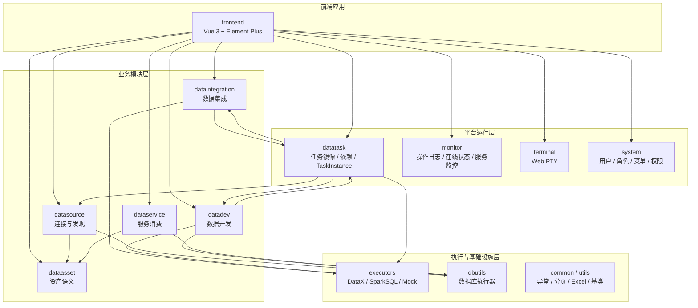
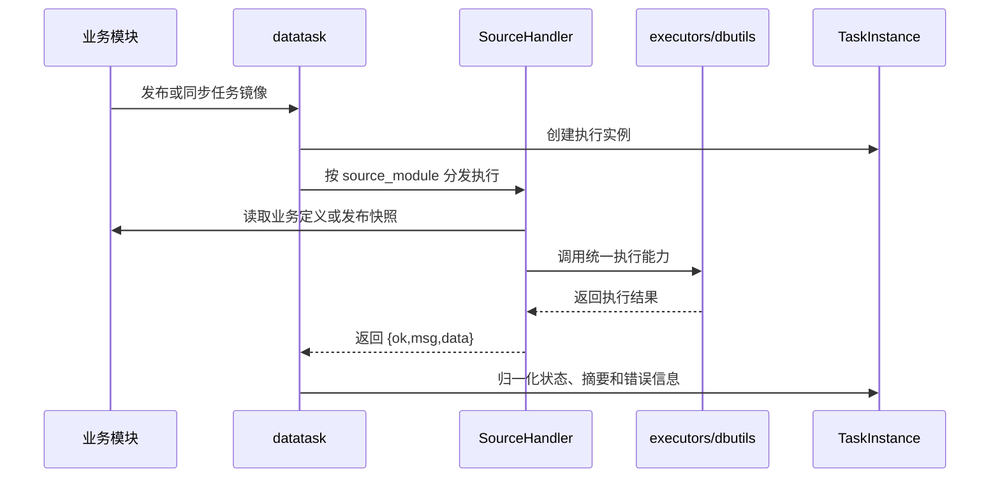

# 平台整体架构

## 设计目标

Data Admin 是一套以 Django 后端和 Vue 前端构建的数据管理平台。当前架构的核心目标不是把所有能力塞进一个中心模块，而是让各业务模块保留自己的业务定义，同时用统一任务内核、统一执行适配和统一资产语义把平台主链路串起来。

平台主链路按五个阶段展开：

1. `datasource`：连接与发现。
2. `dataintegration`：数据集成。
3. `datadev`：数据开发。
4. `datatask`：任务编排与运行运维。
5. `dataasset` / `dataservice`：资产化与服务消费。

辅助模块包括 `system`、`monitor`、`terminal`、`executors`、`dbutils`、`common` 和前端应用。

## 分层结构

## 关键设计原则

1. 业务定义留在业务模块。`datasource`、`dataintegration`、`datadev` 各自保存正式任务定义。
2. `datatask.Task` 是平台任务镜像和调度索引，不是业务定义真源。
3. `datatask.TaskInstance` 是唯一执行实例中心，手动、定时和依赖触发的执行记录都应归集到这里。
4. 数据库连接、查询和探查统一通过 `dbutils` 或 datasource 提供的连接上下文，不在业务模块里散落驱动代码。
5. DataX、Spark SQL、MVP 预演等运行能力统一沉淀到 `executors`，业务模块只描述要执行什么。
6. 跨模块写入资产语义必须通过 `dataasset.facades`，不能绕过资产模块内部边界。
7. 前端按模块入口组织页面，模块首页只承载入口和概览，具体工作台下沉到子页面。

## 任务运行协作

## 文档边界

本文只描述平台整体设计。模块细节见 `docs/architecture/modules/`；开发步骤见 `docs/developments/`；全局技术与重大决策见 `docs/adr/`；反复问题处理见 `docs/troubleshooting/`。
